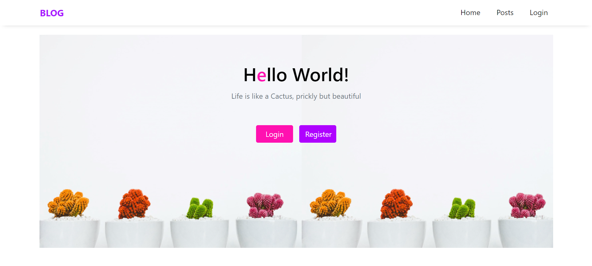
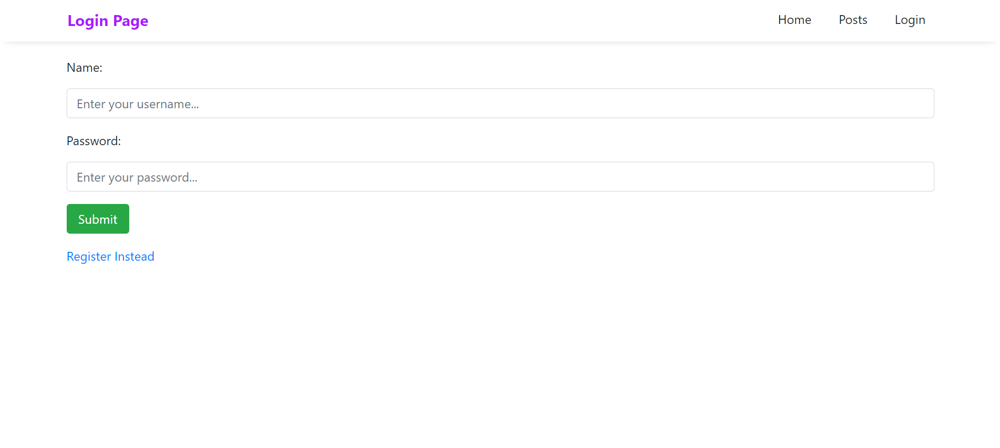
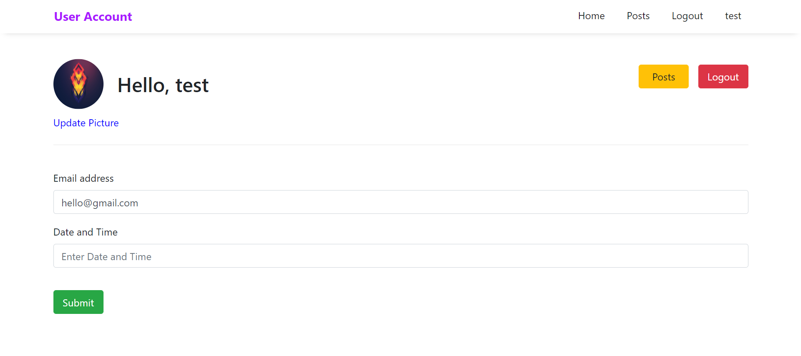
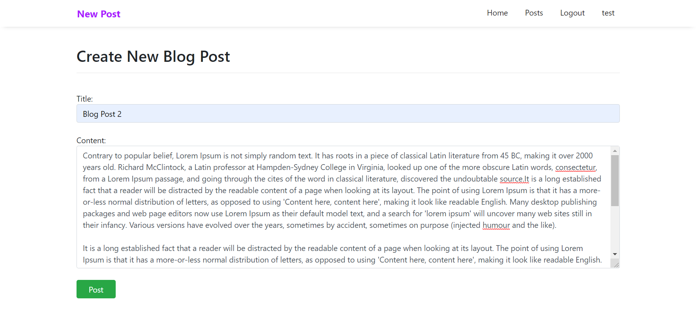
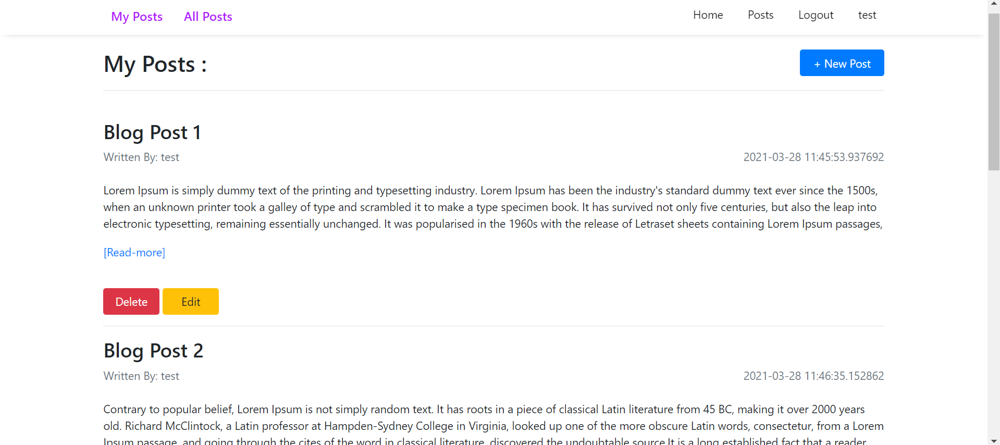
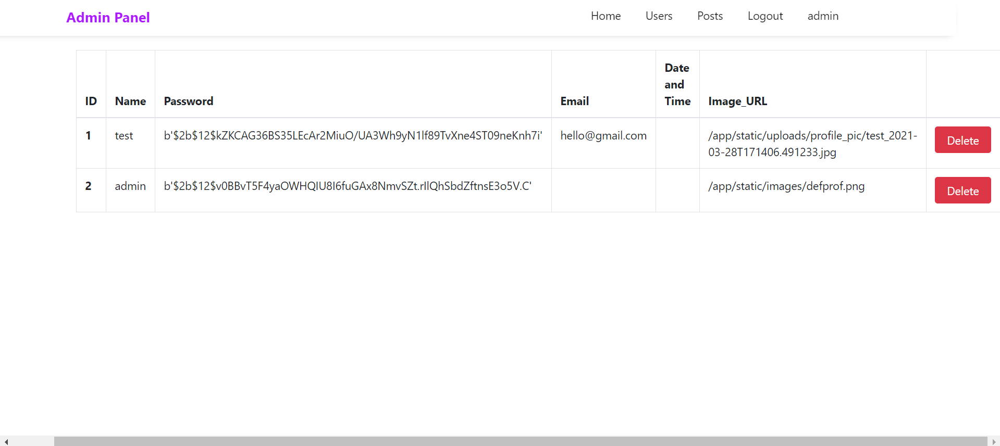
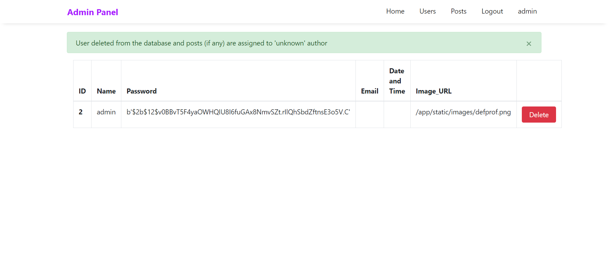

# Blog_App
A simple text Blog using Flask

 

## Installation
------------

    $ git clone https://github.com/Ronik22/Blog_App.git
    $ cd Blog_App
    $ virtualenv venv
    $ . venv/bin/activate
    (venv) pip install -r requirements.txt
    (venv) python run.py

Note for Python 3.4 users: replace `virtualenv` with `pyvenv`.

Note for Microsoft Windows users: replace the virtual environment activation command above with `venv\Scripts\activate`.

 

## Images
 

    
    
    
    
    
    
    
    

